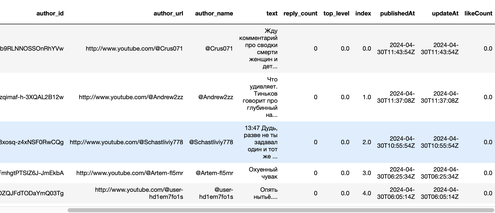
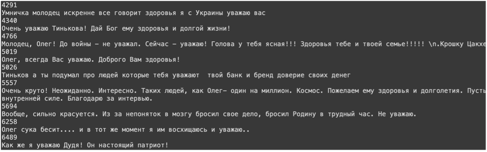
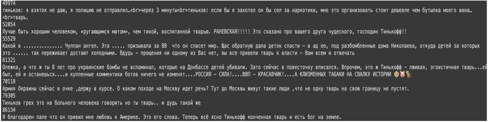

# NLP spring 2024 project

## The main goal of the project : detect toxic/offensive/inappropriate behaviour (in YouTube comments)

## [Report](./report/report_MI_eng.pdf)

## Repository elements
- Notebooks : .ipynb jupyter notebooks with experiments:
  - get_YT_data.ipynb - retrieving youtube comments (API credentials are hidden, by github's requirements)
  - modeling.ipynb - data prep and LDA usage
  - clusters and visual tsne.ipynb - getting ruBERT embeddings, clustering and visualising with t-SNE
- data path - text file with used data on google drive (since github does not allow to upload large files)
    
- Report - .pdf file with report

## Dataset info and examples

Dataset includes 94360 comments unlabeled in the first place, but it was labeled by regular expressions that are found in mentioned related work, plus some of the words were added to regex that were specific to the context of video-material that could be easily distinguished as offensive. Those included all variations of obscenely offensive / abusive / profanity language.

- example of what was marked as "positive"

- example of what was marked as "negative/toxic/offensive"

## Models and processing
- LDA topics as features (number of topic)
- CatBoost on ruBERT embeddings
- k-Means clusters as features (number of cluster)
  
1.  Number of comments for each author extracted as feature
2.	Comments of rare users (commented less than 3 times) are discarded.
3.	Delete stop words (English and Russian).
4.	Lemmatization (With SpyCy library, file "ru_core_news_sm" )

## Results
| Work | Model (Models) |Specification | F-1 Score | Accuracy score |
| --- | --- |  --- | --- |  --- | 
| [Skowronski (2019)] | DecisionTreeClassifier | Classic ML | 0.65 | 0.92 |
| [Kudugunta and Ferrara (2018) and Mazza et al. (2019)] | Neural network | VAE, LSTM, custom architectures | 0.9 | 0.94 |
| [Ю.В.Рубцова (2014) and Rogers et al. (2018)] | MLP Classifier | Sentiment analysis | 0.67 | 0.81 |
| Present research | CatBoost | RuBERT embeddings, clustering topics as features (LDA and K-means) | 0.74 | 0.85 |

